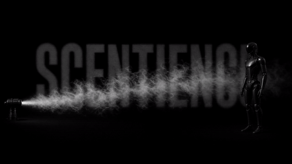

# Robotics Olfaction Package for Nvidia Isaac Sim and Isaac Lab

[](https://arxiv.org/abs/2602.19577)

[](https://github.com/isaac-sim/IsaacSim)
[](https://github.com/isaac-sim/IsaacLab)

[](https://colab.research.google.com/drive/1H5OSeO43YfhAT9MqcJKaaSknFYhjimvg?usp=sharing)
[](https://huggingface.co/kordelfrance/Olfaction-Vision-Language-Embeddings)

[](media/scentience_robot.MP4)

This repository is a growing effort to give proper simulation tools for 
chemical sensing, plume tracking, and olfactory navigation for robotics.
It contains chemical plume models and
virtual Scentience olfactory sensors for NVIDIA Isaac Sim / Isaac Lab,
Gymnasium, and standalone Python. 
To our knowledge, this is the first olfactory and
chemical sensing package for Isaac Sim.

Developed by Kordel France.

## Quick Start
Only 5 lines to smell:


```python
from scentience_olfaction import OlfactionWorld

world = OlfactionWorld.simple()               # ethanol source, 1 m/s wind
world.step(0.05)
reading = world.read((5.0, 0.0, 1.0))         # virtual Scentience device
truth   = world.truth((5.0, 0.0, 1.0))        # ground truth, for debugging
```

`pip install -e .` -- core needs only NumPy. `pip install -e ".[dev]"` for
everything (Warp, torch, gymnasium, pytest). `pytest -m "not isaac"` runs the
full physics validation on CPU, no Isaac, no GPU.

## Features Included

| | |
|---|---|
| **Plume transport** | Filament model (Farrell 2002): multi-species, multiple emitters, walls (occupancy + line-of-sight + slide), two-scale turbulence. NumPy reference + Warp GPU twin, parity-tested. |
| **Sensor suite** | Two chemical (metal-oxide) sensors, `chem_left` / `chem_right`, for stereo olfaction -- each samples the plume at its own position across a configurable baseline, with the full signal chain per sensor (power law -> asymmetric lag -> drift/1-f -> ADC divider). Plus a CO2 channel (photoacoustic, ASC), electrochemical cells (linear + Cottrell), and PID. Full Scentience V1 device in the hardware BLE channel schema. |
| **Realism gate** | CI-enforced plume statistics vs published turbulence theory. A plume that gets too easy FAILS THE BUILD. |
| **OIO** | Olfactory Inertial Odometry reference implementation (France et al., arXiv:2506.04539; Chasing Ghosts bout detection) with UAV / quadruped / biped / arm presets. |
| **RL** | Gymnasium `PlumeNavEnv` (hardware-shaped observations, stereo cue included), cast-and-surge + stereo (onset-lag steering, sensor-only source declaration; Chasing Ghosts, arXiv:2602.19577) + random baselines, episode recorder. Isaac Lab `SensorBase` integration. |
| **Provenance** | Every physical constant carries an evidence level (MEASURED/DATASHEET/DIGITIZED/SYNTHESIZED/ASSUMED); `claim_check()` refuses claims the evidence cannot support. |

## Examples

```bash
python examples/01_minimal.py                                # smell in 5 lines
python examples/02_walls_and_wind.py                         # plume vs a wall
python examples/03_olfactory_inertial_odometry.py --platform quadruped   # or uav|biped|arm
python examples/04_gym_baseline.py                           # the benchmark loop
python examples/05_stereo_olfaction.py                       # two sensors, one plume: lateralisation
```

Visual verification (`pip install "scentience-olfaction[viz]"`):
`python scripts/plot_verification.py` renders ground truth vs the slow and
fast device responses, and the stereo left/right cue, as PNGs.
Something not working? See `docs/TROUBLESHOOTING.md`.

## Know these numbers before deploying:

One can consider these as tuning parameters for the package.
We have done our best to provide reasonable default values for generalized
simulation scenarios. However, for optimal performance, these values should
be tuned to the specific application.

**1. Large-scale meander is not optional.** Blank-duration CV 1.7 +/- 0.4
with it (range 1.4-2.4 over 5 seeds), 0.95 +/- 0.02 without (600 s @ 100 Hz,
8 m downwind). CV < 1 means exponential blanks: no search problem, and
policies learn gradient ascent that fails on hardware. Tail exponents bracket
the -3/2 of Celani et al. (PRX 4:041015). Seed and threshold conventions in
`docs/CHEMICAL_MODEL.md`.

**2. Sensor bandwidth gates what a policy can see.** On an identical plume,
a packaged MOX (tau_fall 12 s) retains **19%** of whiff events; a fast sensor
(46 ms, time constants per Dennler et al., Sci. Adv. 2024) retains **97%**.
State your `sensor_profile` in every result.

**3. Sensitivity coefficients.** 
Sensitivity coefficients ship as DIGITIZED/SYNTHESIZED evidence (datasheets
publish graphs, not tables). Plumes
are implemented from Farrell's published equations since those from Gaden, et al.
have license restrictions. See
`docs/LICENSES_AND_PROVENANCE.md`.

## Isaac Sim / Isaac Lab status

The Isaac Lab sensor (`scentience_isaaclab/`) targets **Isaac Lab 3.x /
Isaac Sim 6.x** (the `env_mask` sensor API) and has been **executed and
verified in a live Isaac Sim install** by the maintainer (2026-09). Run
`scripts/validate_install.py` inside Isaac to confirm your own install --
its checks now expect the 3.x API -- and see `docs/ISAAC_COMPATIBILITY.md`
for the full validation record. Users pinned to Isaac Lab 2.3.x / Isaac
Sim 5.1 should use the last 2.3.x-era release (see `BRANCHING.md`); the
offline validation harnesses (`scripts/check_isaaclab_*.py`) still target
the 2.3.2 wheel and are pending a re-point to a 3.x wheel.

## Cite

See `CITATION.cff`. Related Scentience research: olfaction standardization
(arXiv:2506.00398), olfactory inertial odometry (arXiv:2506.04539),
accelerated chronoamperometry (arXiv:2506.04540), Chasing Ghosts
(arXiv:2602.19577).

## License

Please see file LICENSE for a full breakdown of the license for this software package.
This software includes a number of subcomponents with separate
copyright notices and license terms - please see the file ACKNOWLEDGEMENTS.

Some components of this package are built off open-sourced Apache 2.0 and/or MIT
licensed software and research.
We do our best to credit the original authors for any work off which this package
is built, but make no claims that this is entirely thorough due to the difficulty
in finding origin of certain aspects of olfaction such as certain plume filament 
algorithms.
By using this package, you acknowledge this risk accordingly.

The Scentience sensor model copyright and license terms can be
found in ./sensors/LICENSE_MODEL file.

