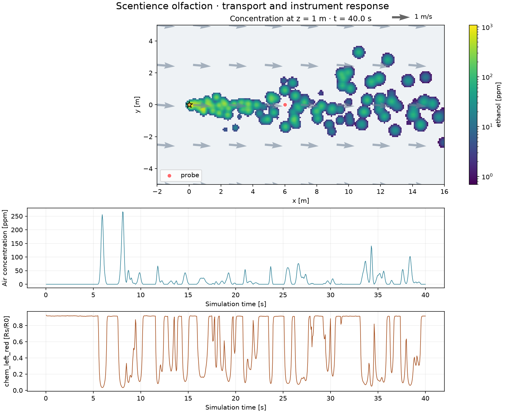

# Scentience Olfaction for NVIDIA Isaac Sim and Isaac Lab

[](https://arxiv.org/abs/2602.19577)
[](https://github.com/isaac-sim/IsaacSim)
[](https://github.com/isaac-sim/IsaacLab)


Chemical transport, instrument response, and navigation tools for robotic
olfaction. Build scent-based tasks with Scentience sensors, Sensirion CO₂
sensors, or calibrated electrochemical cells connected to an EmStat Pico.
The NumPy core runs on a laptop; optional Torch and Warp backends support
batched Isaac workflows.

Developed by Kordel France and Scentience, Inc. The Scentience models build on
the research listed in [CITATION.cff](CITATION.cff). Calibration assumptions and
manufacturer specifications are documented separately from software validation.

## Quick start

Python 3.10 or newer; use the Python version required by your Isaac installation
when running inside Isaac Sim.

```bash
python -m pip install -e .
python examples/01_minimal.py
```

```python
from scentience_olfaction import OlfactionWorld

world = OlfactionWorld.simple()
world.step(0.05)
reading = world.read((5.0, 0.0, 1.0))  # instrument output; each read advances the device
truth = world.truth((5.0, 0.0, 1.0))   # ppm, for evaluation and debugging
```

NumPy is the only required dependency. Optional extras are `viz`, `envs`,
`gpu`, `torch`, `train`, and `dev`. See [setup](SETUP.md) for installation,
validation, and common problems.

## Capabilities

| Area | Included | Scope |
|---|---|---|
| Transport | Filaments, multiple species/sources, temporal releases, molar source rates, turbulence, background concentrations, loss diagnostics | NumPy reference; Warp implements a checked subset. See [transport](docs/TRANSPORT.md). |
| Scentience | Stereo MiCS-6814 RED/NH₃/OX channels, CO₂, two EC channels; response lag, environment coupling, noise, drift, ADC readout | Shared tunable calibration with [NumPy/Torch fidelity notes](docs/SCENTIENCE_MODELS.md). |
| Sensirion | SCD30, SCD40, SCD41; model-specific sampling, diffusion lag, accuracy envelope and quantization | Optional [manufacturer profiles](docs/SENSOR_PROFILES.md); firmware is not emulated. |
| PalmSens | EmStat Pico current readout, 2/3 electrodes, one/two independent cells | Fixed-bias cell calibration required; no EIS or voltammetry solver. |
| Robot integration | Rigid-link mounting, full 3D offsets, stereo sampling, environment origins and selected resets | [Isaac Lab adapter](docs/ISAAC_INTEGRATION.md); independent of robot articulation/control. |
| Odometry | Olfactory inertial odometry reference plus frame-aware IMU adapters | Timestamp, gravity and frame conventions are explicit. |
| Learning | Gymnasium environment, history wrapper, PPO/SAC/TD3 commands, sensor-only baselines | [Training guide](docs/TRAINING.md); Isaac runner registration for existing robot tasks. |
| Evaluation | Plume slices, sensor traces, path length, success/SPL, declaration metrics, seeded logs and config fingerprints | [Research workflow](docs/RESEARCH_WORKFLOW.md). |

## Configure sensors and scenes

```python
from scentience_olfaction.config import load_world

world = load_world("configs/scd41.json")
world.step(0.1)
reading = world.read((2.0, 0.0, 1.0))
```

Change `device_profile` to `scd30`, `scd40`, or `scd41`. Use
[emstat_dual.json](configs/emstat_dual.json) for independently calibrated EC
cells; remove a channel for a single sensor and choose `electrode_count` per
cell. Its example sensitivities are explicitly illustrative.

For Scentience, `device_config` accepts the shared `DeviceConfig` fields,
including six individual MOX calibrations and CO₂/EC settings. Unknown JSON
keys fail with an error. Python dataclasses support custom airflow and geometry
without forcing a file format on advanced users. See
[configuration](docs/CONFIGURATION.md).

## Run a research workflow

```bash
python -m pip install -e ".[viz,train]"
python scripts/plot_plume.py --out runs/plume
python scripts/plot_verification.py --outdir runs/response
python scripts/benchmark.py --config configs/navigation.json --episodes 5 --record --out runs/benchmark
python scripts/train_sb3.py --config configs/navigation.json --algorithm ppo --out runs/ppo
python scripts/train_sb3.py --evaluate runs/ppo --seed 100 --episodes 10
```

Training saves its environment configuration, observation normalization,
checkpoint, seed, and software versions. Evaluate on held-out seeds and
conditions. The benchmark compares random, cast-and-surge, and stereo
cast-and-surge policies using device observations.



The figure is generated by `plot_plume.py`; its configuration and versions are
stored in [the run record](media/plume_response.json).

Examples also cover [walls and wind](examples/02_walls_and_wind.py),
[olfactory inertial odometry](examples/03_olfactory_inertial_odometry.py),
[stereo sensing](examples/05_stereo_olfaction.py), and
[manufacturer sensors](examples/06_configurable_sensors.py).

## Isaac compatibility and scientific validation

The maintainer verified the original integration in Isaac Sim 6.x / Isaac Lab
3.x. The revised adapter targets that API; its current validation status and
live checks are recorded in [Isaac compatibility](docs/ISAAC_COMPATIBILITY.md).
Offline checks do not establish that every robot asset works in a live scene.
The [validation record](docs/VALIDATION.md) lists the local test, packaging,
training and visualization results, along with the remaining hardware checks.

```bash
python -m pip install -e ".[dev]"
python -m ruff check .
python -m pytest -m "not isaac and not slow"
```

Run `python -m pytest -m slow` for the longer statistical checks. Tests cover
conservation/loss, source schedules, stochastic replay, sensor dynamics,
backend parity, partial resets, and learning interfaces. The plume statistics
gate is a regression check for a specified benchmark, not a general validation
of turbulent flows. Sensor bandwidth and event retention depend on calibration,
plume parameters, sampling, and detection thresholds.

For integration design and a proposed NVIDIA showcase/contribution scope, see
[ecosystem assessment](docs/ECOSYSTEM.md). No NVIDIA endorsement is implied.

## License and contributions

The existing [LICENSE](LICENSE), [sensor research model terms](scentience_olfaction/sensors/LICENSE_MODEL),
[NOTICE](NOTICE), and [ACKNOWLEDGEMENTS](ACKNOWLEDGEMENTS) govern this repository.
The sensor terms restrict use to research. This repository is **not licensed
uniformly under Apache-2.0**. Its selected optional software dependencies use
permissive licenses; Isaac runtime components and assets retain their own terms.
See [dependency and provenance notes](docs/LICENSES_AND_PROVENANCE.md).

Contributions should include calibration provenance, a focused functional test,
and the runtime versions used for validation. See [CONTRIBUTING.md](CONTRIBUTING.md).
